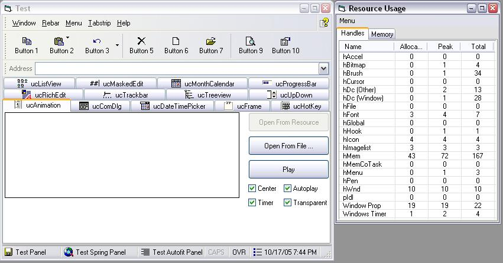



## vbComCtl \- revisited

### Description

Your GUI dream come true. 20 usercontrols to replace MS common controls 1, 2, and 3, the richedit and masked edit libraries, plus nice looking popup menus and a CC 6.0 friendly replacement for VB.Frame. Lots of goodies here.

UPDATE:

major refactoring done. vbBase.dll is history. now there is only the ocx and the test project. All api declares have been moved to a tlb, which allows for simply toggling overriding those declares using a compiler switch. This means that every singe allocated resource is tracked to ensure zero leakage. (See screen shot) Serious optimizations for size and speed. Eight bottleneck functions written in pure assembly. This is a veritable mountain of useful code, whether you want to take the time to figure out how it works for yourself or just remove the parts you need for your app. Recommended highlights: pcIntegerMap &amp; pcStringMap for hash tables, mSubclass for asm subclassing (not Paul's, even better!), and mDebug for some techniques you could use to track all allocated resources in other projects.
 
### More Info
 

             |
---                |---
**Submitted On**   |2005-10-17 19:50:50
**By**             |[selftaught](https://github.com/Planet-Source-Code/PSCIndex/blob/master/ByAuthor/selftaught.md)
**Level**          |Advanced
**User Rating**    |5.0 (110 globes from 22 users)
**Compatibility**  |VB 6\.0
**Category**       |[Miscellaneous](https://github.com/Planet-Source-Code/PSCIndex/blob/master/ByCategory/miscellaneous__1-1.md)
**World**          |[Visual Basic](https://github.com/Planet-Source-Code/PSCIndex/blob/master/ByWorld/visual-basic.md)
**Archive File**   |[vbComCtl\_\-19412710172005\.zip](https://github.com/Planet-Source-Code/selftaught-vbcomctl-revisited__1-62937/archive/master.zip)

